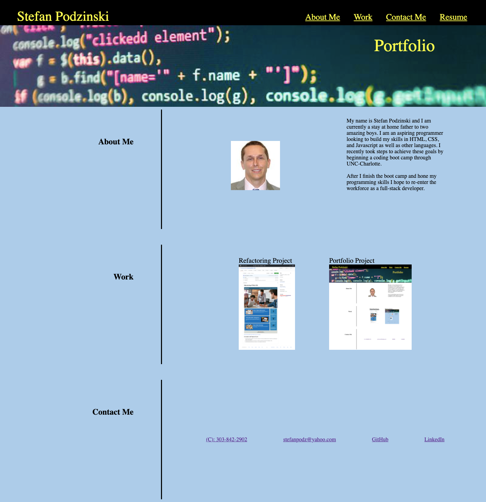

# Stefan-Podzinski-Portfolio

## Table of contents
- [Description](#Description)
- [Installation](#Installation)
- [Usage](#Usage)
- [License](#License)
- [Technologies Used](#Technologies)
- [Contributors](#Contributors)
- [Test](#Test)
- [Repository Link](#Repository)
- [Deployed Link](#Deployed)
- [GitHub Info](#GitHub) 

## Description 
Personal portfolio webpage built using HTML, CSS and Bootstrap in the hopes of using it later on to showcase the skills I've learned in the UNC-Charlotte coding boot camp. For this particular project I specifically tried to showcase the use of links to in browser navigation and to external projects and professional social media pages. As well as the use of FlexBox and other advanced CSS techniques. There is still a lot of work to be done especially in regards to making it mobile responsive.

## Installation
None.

## Usage
This application will be used as a professional portfolio page to showcase my full-stack development skills.

## License
ISC

## Technologies
HTML, CSS and Bootstrap

## Contributors
Stefan Podzinski

## Tests
None

## Repository
https://github.com/stefanpodz303/Stefan-Podzinski-Portfolio

## Deployed
https://stefanpodz303.github.io/Stefan-Podzinski-Portfolio/

## GitHub
- stefanpodz303
- stefanpodz@yahoo.com

 